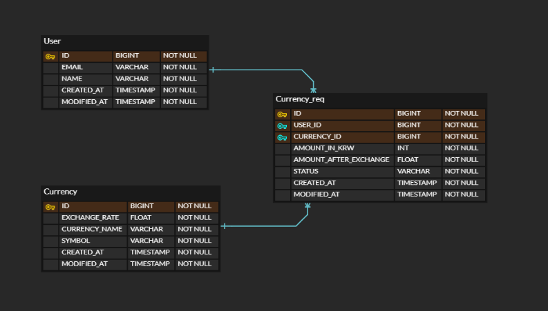

# API 명세
## 일정
### 등록

- Method : POST
- URI:/exchanges
- Request
    - PathVariable : 없음
    - RequestBody :

      |   | 이름          | 타입   | 필수여부 | 설명           |
      |---|-------------|------|------|--------------|
      | 1 | userId     | Long | 필수   | 사용자 식별자      |
      | 2 | currencyId | Long | 필수   | 환전 대상 통화 식별자 |
      | 3 | amountInKrw       | int  | 필수   | 환전 전 금액      |

- Response

  |   | 이름                    | 타입     | 설명        |
      |---|-----------------------|--------|-----------|
  | 1 | exchangeId           | Long   | 환전 요청 식별자 |
  | 2 | userId               | Long   | 사용자 식별자   |
  | 3 | currencyId           | Long   | 환전 대상 식별자 |
  | 4 | amountInKrw         | Long   | 환전 후 식별자  |
  | 4 | amountAfterExchange | Long   | 환전 후 식별자  |
  | 5 | status                | Long   | 환전 요청 식별자 |
  | 6 | modifiedAt           | Long   | 환전 요청 식별자 |

### 조회

- Method : GET
- URI:/exchanges/{user_id}
- Request
    - PathVariable :

      |   | 이름          | 타입     | 필수여부 | 설명           |
            |---|-------------|--------|------|--------------|
      | 1 | userId     | Long   | 필수   | 사용자 식별자      |
    - RequestBody : 없음

- Response

  |   | 이름                    | 타입     | 설명        |
    |---|-----------------------|--------|-----------|
  | 1 | exchangeId           | Long   | 환전 요청 식별자 |
  | 2 | userId               | Long   | 사용자 식별자   |
  | 3 | currencyId           | Long   | 환전 대상 식별자 |
  | 4 | amountInKrw         | Long   | 환전 후 식별자  |
  | 4 | amountAfterExchange | Long   | 환전 후 식별자  |
  | 5 | status                | Long   | 환전 요청 식별자 |
  | 6 | modifiedAt           | Long   | 환전 요청 식별자 |

### 환전 상태 취소

- Method : GET
- URI:/exchanges/{exchange_id}
- Request
    - PathVariable :

      |   | 이름          | 타입     | 필수여부 | 설명     |
            |---|-------------|--------|------|--------|
      | 1 | exchangeId | Long   | 필수   | 환전 식별자 |
    - RequestBody : 없음

- Response

  |   | 이름                    | 타입     | 설명        |
      |---|-----------------------|--------|-----------|
  | 1 | exchangeId           | Long   | 환전 요청 식별자 |
  | 2 | userId               | Long   | 사용자 식별자   |
  | 3 | currencyId           | Long   | 환전 대상 식별자 |
  | 4 | amountInKrw         | Long   | 환전 후 식별자  |
  | 4 | amountAfterExchange | Long   | 환전 후 식별자  |
  | 5 | status                | Long   | 환전 요청 식별자 |
  | 6 | modifiedAt           | Long   | 환전 요청 식별자 |

### 삭제

- Method : GET
- URI:/exchanges/{user_id}
- Request
    - PathVariable :

      |   | 이름          | 타입     | 필수여부 | 설명           |
            |---|-------------|--------|------|--------------|
      | 1 | userId     | Long   | 필수   | 사용자 식별자      |
    - RequestBody : 없음

- Response: 200 OK

### 공통 예외

## ERD

